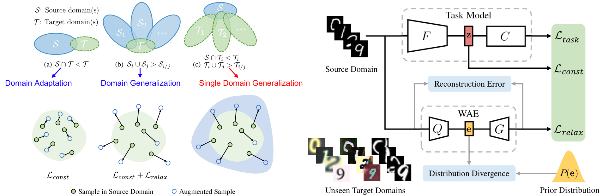

# Learning to Learn Single Domain Generalization (CVPR 2020)

This repository holds the Pytorch implementation of [Learning to Learn Single Domain Generalization](https://arxiv.org/abs/2003.13216) by Fengchun Qiao, Long Zhao and Xi Peng. 

## Introduction

We are concerned with a worst-case scenario in model generalization, in the sense that a model aims to perform well on many unseen domains while there is only one single domain available for training. We propose a new method named adversarial domain augmentation to solve this Out-of-Distribution (OOD) generalization problem. The key idea is to leverage adversarial training to create “fictitious” yet “challenging” populations, from which a model can learn to generalize with theoretical guarantees.

<p align="center"></p>

## Prerequisites

This package has the following requirements:

* `Python 3.6`
* `Pytorch 1.1.0`
* `MetaNN 0.1.5`
* `Scipy 1.2.1`

## Training 

Download and process [MNIST](http://yann.lecun.com/exdb/mnist/):

```
cd utils
python download_and_process_mnist.py
```

Run the following command:

```
python main_Digits.py
```

## Evaluation

The pretrained models can be downloaded from [Google Drive](https://drive.google.com/open?id=19VGuIsv38JutNCkKrG3htBBau3gomhYC). Put `checkpoint` in the project root directory.

To evaluate on [Digits](https://arxiv.org/abs/1805.12018), run:

```
mkdir ./data/svhn
wget http://ufldl.stanford.edu/housenumbers/test_32x32.mat -O "./data/svhn/test_32x32.mat"  # download the test set of svhn
python main_Digits.py --mode test --resume checkpoint/pretrained/ckpt_mnist.pth.tar
```


## Citation

If you find our code useful in your research, please consider citing:

```
@inproceedings{qiaoCVPR20learning,
  title={Learning to learn single domain generalization},
  author={Qiao, Fengchun and Zhao, Long and Peng, Xi},
  booktitle={IEEE Conference on Computer Vision and Pattern Recognition (CVPR)},
  pages={12556--12565},
  year={2020}
}
```


## Acknowledgement

Part of our code is borrowed from the following repositories.

- [generalize-unseen-domains](https://github.com/ricvolpi/generalize-unseen-domains)
- [WideResNet-pytorch](https://github.com/xternalz/WideResNet-pytorch)
- [WAE-pytorch](https://github.com/1Konny/WAE-pytorch)

We thank to the authors for releasing their codes. Please also consider citing their works.